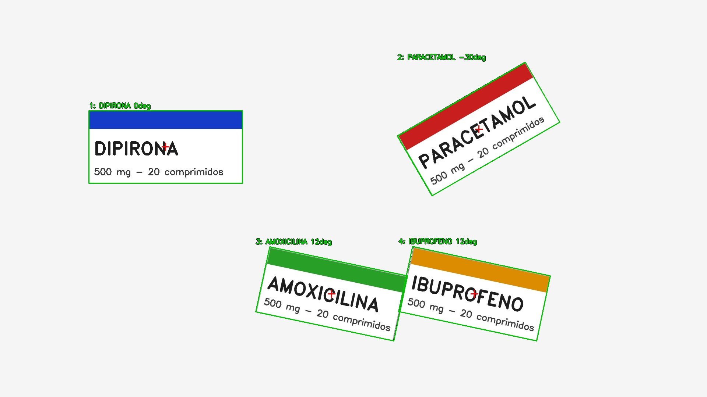

# only-vision

Sistema de visão para um braço robótico **SCARA**: localiza caixas de remédio sobre uma mesa branca e devolve, em JSON, a posição, o ângulo e o texto escrito em cada caixa.

Combina duas coisas:

- **Gemini (IA)** — encontra as caixas na imagem e lê o que está escrito nelas.
- **OpenCV** — refina a posição de cada caixa com precisão de pixel (centro, tamanho e ângulo), inclusive separando caixas encostadas.



## Como funciona

1. A câmera é lida continuamente em uma thread (o frame analisado é sempre o mais recente).
2. Quando a cena fica parada e mudou desde a última análise (ou ao apertar `ESPAÇO`), o frame é enviado ao Gemini.
3. O Gemini devolve as caixas (`box_2d`), o nome e o texto de cada uma.
4. O OpenCV segmenta os objetos da mesa, separa caixas encostadas com *watershed* (usando o centro de cada caixa do Gemini como semente) e calcula o retângulo rotacionado com `minAreaRect`.
5. O resultado é impresso no terminal e salvo em `saida/ultimo_resultado.json` e `saida/ultimo_resultado.jpg`.

Se o modelo principal do Gemini estiver sobrecarregado, o código tenta automaticamente os modelos reserva (`MODELOS_RESERVA` em `vision_remedios.py`).

## Instalação

Requer Python 3.10+.

```bash
pip install -r requirements.txt
```

Crie o arquivo `.env` a partir do exemplo e coloque sua chave do [Google AI Studio](https://aistudio.google.com/apikey):

```bash
cp .env.example .env
```

```env
GEMINI_API_KEY=sua_chave_aqui
GEMINI_MODEL=gemini-3.8-flash
```

## Uso

```bash
python vision_remedios.py                    # câmera 0
python vision_remedios.py --camera 1         # outra câmera
python vision_remedios.py --imagem foto.jpg  # analisa uma imagem e sai
python vision_remedios.py --mascara          # mostra a máscara do OpenCV (debug)
```

| Opção | Padrão | Descrição |
|---|---|---|
| `--camera` | `0` | índice da câmera |
| `--imagem` | — | analisa um arquivo em vez da câmera |
| `--modelo` | `GEMINI_MODEL` do `.env` | modelo Gemini |
| `--largura` / `--altura` | `1920` / `1080` | resolução de captura |
| `--conf` | `0.5` | confiança mínima do Gemini para aceitar uma caixa |
| `--mascara` | — | abre uma janela com a máscara de segmentação |

### Teclas

| Tecla | Ação |
|---|---|
| `b` | captura o fundo — **faça isso com a mesa vazia** antes de colocar as caixas |
| `ESPAÇO` | analisa o frame atual |
| `a` | liga/desliga a análise automática |
| `s` | salva o frame atual em `saida/` |
| `q` / `ESC` | sai |

> Capturar o fundo (`b`) melhora muito a segmentação, principalmente com caixas brancas sobre a mesa branca.

## Saída

```json
{
  "timestamp": "2026-10-07T09:31:25.550",
  "modelo": "gemini-robotics-er-2-preview",
  "resolucao": [1920, 1080],
  "tempo_gemini_s": 23.65,
  "calibrado_mm": false,
  "total": 1,
  "caixas": [
    {
      "id": 1,
      "nome": "PARACETAMOL",
      "texto": "PARACETAMOL | 500 mg - 20 comprimidos",
      "confianca": 0.99,
      "centro_px": [1300.1, 351.1],
      "bbox_px": [1077, 165, 1520, 533],
      "cantos_px": [[1171.9, 538.3], [1072.4, 366.0], [1426.8, 161.4], [1526.3, 333.8]],
      "tamanho_px": [401.0, 187.9],
      "angulo_graus": -30.0,
      "box_2d_gemini": [153, 561, 494, 792],
      "fonte_posicao": "opencv+gemini"
    }
  ]
}
```

- **Coordenadas** em pixels, origem no canto superior esquerdo (x → direita, y → baixo).
- **`angulo_graus`**: ângulo do lado maior da caixa em relação ao eixo x, em [-90, 90); positivo = sentido horário na imagem.
- **`fonte_posicao`**: `opencv+gemini` quando o OpenCV refinou a posição (mais preciso); `gemini` quando usou só a caixa do Gemini (sem ângulo).
- **`centro_mm`**: aparece quando existe calibração (ver abaixo).

## Calibração para milímetros

Para converter pixels em coordenadas do robô, crie um `calibracao.json` na raiz com a homografia `H` (pixel → mm):

```json
{ "H": [[h11, h12, h13], [h21, h22, h23], [h31, h32, h33]] }
```

Com o arquivo presente, cada caixa passa a ter `centro_mm`. A ideia é gerar a `H` com um tabuleiro xadrez sobre a mesa (`cv2.findChessboardCorners` + `cv2.findHomography`).

## Montagem recomendada

- **Câmera** a ~80–90 cm, apontada para baixo, com foco e exposição **manuais/fixos**.
- **Iluminação** branca neutra/fria (**5000–6500 K**, **IRC ≥ 90**), **difusa** (softbox ou difusor leitoso). Duas fontes a ~45° em lados opostos ou um ring light ao redor da câmera eliminam praticamente todas as sombras. Evite luz colorida — distorce as cores das embalagens e prejudica a leitura do texto.
- Para caixas com acabamento brilhante, um **filtro polarizador** na lente reduz reflexos.

## Estrutura

```
vision_remedios.py   # código principal
requirements.txt
.env.example         # modelo do .env (a chave real não vai para o git)
docs/exemplo.jpg     # imagem de exemplo do README
saida/               # resultados gerados (ignorado pelo git)
```
